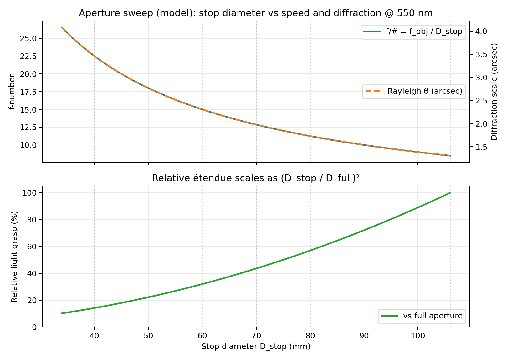
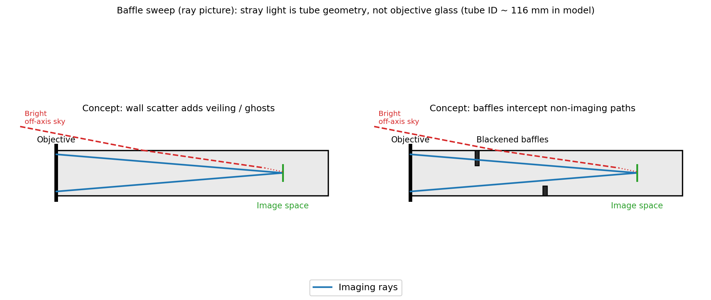

# Q001 Telescope Builder

Foundation project for modeling and assembling a DIY refractor telescope using:

- Objective lens: 106 mm diameter (nominal), 900 mm focal length (**confirmed** by the builder)
- Eyepieces: 1.25" Plossl 25 mm and 10 mm (about 50 deg AFOV)
- Focuser travel: **±50 mm** rack (~**100 mm** total), **confirmed** by the builder

References:

- [Altair 1.25 inch Eyepiece Set (10 mm + 25 mm)](https://altairastro.com/125-inch-eyepiece-set-pl-10mm--25mm-11799-p.asp)
- [106 mm DIY objective listing](https://www.ebay.fr/itm/174771591801?utm_source=chatgpt.com)

## 1) Project Goal

Create a practical, testable foundation for:

1. Optical path calculations (magnification, exit pupil, field of view, diffraction estimate)
2. First-cut mechanical geometry (tube length and focus budget)
3. Initial baffle sizing
4. A step-by-step physical assembly process

This is intentionally a first engineering pass, not a full Zemax-grade design.

## 2) Quick Start

From this directory:

```bash
python model.py
```

The script prints:

- Telescope performance summary
- First-cut tube-length estimate
- Eyepiece performance table
- Suggested baffle diameters at example positions

It also generates plot images in [`plots/`](plots/):

- [`plots/beam_cone_and_baffles.png`](plots/beam_cone_and_baffles.png)
- [`plots/eyepiece_performance.png`](plots/eyepiece_performance.png)
- [`plots/focus_budget.png`](plots/focus_budget.png)
- [`plots/template_tube_layout.png`](plots/template_tube_layout.png)
- [`plots/template_focuser_drill.png`](plots/template_focuser_drill.png)
- [`plots/template_printed_parts_overview.png`](plots/template_printed_parts_overview.png)
- [`plots/aperture_sweep_physics.png`](plots/aperture_sweep_physics.png) (stop diameter vs f/#, diffraction, light grasp)
- [`plots/baffle_sweep_concept.png`](plots/baffle_sweep_concept.png) (ray schematic: stray light vs baffles)
- [`data/planet-lid-with-4cm-hole.jpeg`](data/planet-lid-with-4cm-hole.jpeg) (builder reference; see aberration analysis)
- [`data/planet-no-lid.jpeg`](data/planet-no-lid.jpeg) (builder reference; see aberration analysis)
- [`data/moon_lid-with-4cm-hole.png`](data/moon_lid-with-4cm-hole.png) (builder reference; see aberration analysis)
- [`data/moon-no-lid.jpeg`](data/moon-no-lid.jpeg) (builder reference; see aberration analysis)

It writes template dimensions to:

- [`templates/template_dimensions.md`](templates/template_dimensions.md)

To regenerate **only** the diagnostic sweep figures (same PNGs as above):

```bash
python scripts/plot_diagnostic_sweeps.py
```

After you fill numeric scores in the field CSV logs, optional **score charts** (written under [`plots/`](plots/) when enough rows are present):

```bash
python scripts/plot_diagnostic_sweeps.py --aperture-csv templates/aperture-sweep-log.csv
python scripts/plot_diagnostic_sweeps.py --baffle-csv templates/baffle-sweep-log.csv
```

→ [`plots/aperture_sweep_scores.png`](plots/aperture_sweep_scores.png), [`plots/baffle_sweep_scores.png`](plots/baffle_sweep_scores.png) (created on demand; not checked in until you run this).

## 3) Optical Model Used

Paraxial Kepler refractor model:

1. Distant objects send near-parallel rays into the objective.
2. Objective forms a real image near its focal plane (~900 mm behind objective).
3. Eyepiece is positioned so its focal plane coincides with that real image.
4. Eye sees a magnified virtual image at infinity.

Core equations:

- `M = f_obj / f_eye`
- `F# = f_obj / D_obj`
- `D_exit = D_obj / M = f_eye / F#`
- `TFOV ~= AFOV / M`
- Diffraction estimate (Rayleigh): `theta = 1.22 * lambda / D`

For symbols and shorthand used in this README and in the diagnostics, see **Section 4 (Terms and Abbreviations)**.

## 4) Terms and Abbreviations

Symbols match [`model.py`](model.py) (`TelescopeConfig`, equations above) unless noted. For **halo**, **ghost**, **veiling**, **detail**, and **Moon terminator**, see [`optical-artifacts-glossary.md`](optical-artifacts-glossary.md).

| Term | Meaning |
|------|---------|
| **Objective** | Front lens that forms a real image of distant objects; here ~106 mm clear diameter, **f_obj** = 900 mm focal length. |
| **Eyepiece** | Magnifier that views the objective’s focal image; **f_eye** is its focal length (e.g. 25 mm, 10 mm). |
| **Kepler(ian) refractor** | Objective + eyepiece layout: intermediate image is real and inverted; classic astronomical refractor. |
| **f_obj** | Objective focal length (mm). |
| **f_eye** | Eyepiece focal length (mm). |
| **D**, **D_obj** | Clear entrance pupil / objective diameter (mm); nominal 106 mm unless you measure otherwise. |
| **D_stop** | Clear diameter of an **aperture mask** or stop during a sweep (mm). |
| **D_full** | Full clear aperture without a mask; usually **D_obj**. |
| **f/#**, **F-number** | Focal ratio **f_obj / D** with **D** the beam-limiting clear aperture (objective or stop). |
| **M** | Visual magnification (planning): **M ≈ f_obj / f_eye** for object at infinity. |
| **D_exit** | Exit pupil diameter (mm): bundle diameter leaving the eyepiece toward the eye; **≈ D / M ≈ f_eye / (f/#)**. |
| **AFOV** | Apparent field of view of the eyepiece (degrees); manufacturer specification. |
| **TFOV** | True field of view on the sky (degrees); here approximated as **AFOV / M**. |
| **λ** (lambda) | Wavelength in diffraction formulas; **550 nm** in the Rayleigh estimate unless stated otherwise. |
| **Paraxial** | Small-angle ray approximation used for layout and cone sketches; adequate for tube/baffle sizing, not full aberration theory. |
| **Marginal / peripheral rays** | Rays from the outer part of the pupil; often dominate spherical and chromatic error at full aperture. |
| **Baffle** | Opaque ring or vane that blocks non-imaging light paths inside the tube; see suggested clear diameters in the model report. |
| **OD**, **ID** | Tube **outside** and **inside** diameter (print templates / `TemplateConfig`). |
| **A_ref** | Reference aperture (mm) chosen after **Script A** (aperture sweep); held fixed during **Script B**. |
| **F_ref** | Repeatable best-focus procedure tied to **A_ref** (field protocol). |
| **B0, B1, B2** | Baffle **states** in Script B (e.g. none / as-built / improved). |
| **CSV** | Comma-separated field log ([`templates/aperture-sweep-log.csv`](templates/aperture-sweep-log.csv), [`templates/baffle-sweep-log.csv`](templates/baffle-sweep-log.csv)). |
| **SCAD** | OpenSCAD source files under [`templates/`](templates/) for printed jigs and rings. |
| **PETG**, **ASA** | Common 3D-printing filaments suggested for mechanical parts. |

## 5) Current Assumptions

- Objective focal length **`f_obj = 900 mm` is confirmed** for the first build. Clear aperture is still treated as **`D = 106 mm`** unless you measure the clear aperture at the cell.
- Focuser travel is **`100 mm` total** (builder reports **±50 mm** from a neutral focus position).  
  If your hardware is only **5 cm total** travel (not ±5 cm), set `focuser_travel_mm = 50.0` in [`model.py`](model.py) and rerun `python model.py`.
- Focuser flange-to-field-stop (fully in) is initially estimated in code as `70 mm`.
- Design target is to place infinity focus near mid travel (~50 mm out from fully in).

When you measure your actual focuser geometry, update:

- `focuser_flange_to_field_stop_infocus_mm`
- (optionally) `focus_margin_mm`

in `TelescopeConfig` inside [`model.py`](model.py).

## 6) Generated Physics Illustrations

These are generated directly by the model and can be refreshed anytime by rerunning:

```bash
python model.py
```

### Optical cone and baffles


Shows the paraxial cone from the objective to focal plane and the suggested minimum baffle clear diameters at three axial positions.

### Eyepiece performance comparison


Compares magnification, exit pupil, and approximate true field for your 25 mm and 10 mm eyepieces on a 900 mm objective.

### Focus budget placement


Illustrates the confirmed focuser travel range and why targeting infinity focus near mid-travel is practical for build tolerance and eyepiece variation.

### Aperture sweep (model curves)



For the configured `f_obj` and nominal full aperture: **f/#** and **Rayleigh diffraction scale** vs stop diameter `D_stop`, plus **relative light grasp** scaling as `(D_stop / D_full)²`. Vertical ticks mark typical mask sizes used in [`diagnostic-aperture-sweep.md`](diagnostic-aperture-sweep.md). This is a planning chart, not a substitute for your logged halo/detail scores.

### Baffle sweep (concept schematic)



Highly simplified **side-view ray sketch**: blue = on-axis imaging cone; red dashed = representative **non-imaging** path from bright off-axis sky via wall scatter toward the focal volume. The right panel adds **blackened baffles** that intercept indirect light. Real tubes are 3D; this matches the idea in [`diagnostic-baffle-sweep.md`](diagnostic-baffle-sweep.md) that baffling is about **geometry and stray paths**, not polishing the objective.

## 7) Cut/Drill Templates + 3D Printed Jigs

This project now includes first-pass printable templates in [`templates/`](templates/):

- [`templates/focuser_drill_jig.scad`](templates/focuser_drill_jig.scad) - tube clamp jig with focuser and bolt-hole guides
- [`templates/baffle_ring.scad`](templates/baffle_ring.scad) - parametric baffle ring
- [`templates/objective_cell.scad`](templates/objective_cell.scad) - objective lens cell + retaining ring preview
- [`templates/template_dimensions.md`](templates/template_dimensions.md) - generated dimension summary

### Tube cut and baffle placement template


Use this as the axial reference map:

- left edge = objective seat (`x = 0`)
- right edge = focuser flange (`x ~ 805 mm` with current assumptions)
- baffle positions marked at `x = 200, 450, 700 mm`

### Focuser drilling template


This graphic maps directly to [`focuser_drill_jig.scad`](templates/focuser_drill_jig.scad):

- center circle = main focuser hole
- 4 corner circles = mounting bolt holes
- outer circle = assumed tube outside diameter

### Printed part set overview


Suggested first print set:

1. Objective cell and retaining ring
2. Baffle rings (3 sizes)
3. Focuser drilling jig

### Suggested printing process

1. Edit dimensions in the `.scad` files to match measured hardware.
2. Export STL from OpenSCAD.
3. Print test coupons (small ring sections) to validate fit.
4. Print full parts in PETG or ASA.
5. Dry-fit before drilling tube.

## 8) First-Cut Build Procedure (Physical Assembly)

1. **Objective mounting**
   - Build a centered lens cell.
   - Avoid pinching the lens; light retaining pressure only.

2. **Main tube**
   - Use the script's tube-length estimate as the first cut.
   - Keep extra margin by cutting slightly long if possible, then trim.

3. **Focuser installation**
   - Mount focuser square to the tube and centered to objective axis.
   - Ensure travel is smooth across the full rack range (~100 mm total).

4. **Stray light control**
   - Matte-black interior.
   - Add 2-3 baffles using script outputs as minimum clear diameters.

5. **First light in daytime**
   - Start with 25 mm eyepiece.
   - Focus on a far terrestrial object.
   - Confirm infinity focus occurs within travel range.

6. **Night validation**
   - Check stars for symmetric focus behavior.
   - If strong asymmetry appears, re-check centering and tilt.

## 9) Notes on the "Microscope Mirror"

Do not use a random microscope mirror as a primary telescope mirror.
It may be useful only as a temporary fold element for experimentation, but quality/surface/coating are often unsuitable for sharp astronomical imaging.

## 10) Physics: why aperture and baffle sweeps improve the image

This project treats light with **geometrical (ray) optics** for layout and intuition: in a uniform medium rays travel straight; at surfaces they reflect or refract. That picture is accurate when apertures and features are **large compared to the wavelength**; it explains the **imaging cone** and **stray-light paths**, but it does not replace wave optics for fine **diffraction** structure (Airy pattern, ring detail on a star).

The two field scripts attack **different** mechanisms. Used in order (aperture first, then baffles), they help you pick settings that maximize **contrast and sharpness you can actually see**, not only raw aperture. The corresponding **model figures** are in **Section 6** ([`plots/aperture_sweep_physics.png`](plots/aperture_sweep_physics.png), [`plots/baffle_sweep_concept.png`](plots/baffle_sweep_concept.png)); optional **score plots** from filled CSVs are described in **Section 2** (Quick Start).

### Aperture sweep ([`diagnostic-aperture-sweep.md`](diagnostic-aperture-sweep.md))

The objective accepts a bundle of nearly parallel rays from a distant object. Rays that strike the lens **far from the axis** (“marginal” or **peripheral** rays) usually contribute most to **monochromatic** errors such as spherical aberration and coma, and to **chromatic** error (different colours bend by different amounts, so colour fringes grow when the full diameter is used). In a short geometrical picture: the outer annulus of the pupil is often the part of the wavefront that is least well corrected.

**Stopping down** with a mask removes those outer rays. The effective diameter `D_stop` shrinks, so the **f-number** `f_obj / D_stop` rises: the cone of imaging rays becomes narrower. Geometrical aberrations tied to ray height typically **fall quickly** as you trim the pupil. The tradeoff is **diffraction**: the smallest detail the optics can resolve scales roughly like **λ / D** (same order as the `theta = 1.22 * lambda / D` estimate in **Optical Model Used**). A smaller `D` means a **larger** diffraction blur in angle—but on many real objectives, especially at full aperture on bright targets, **geometrical blur and colour error shrink faster than diffraction grows**, so the image **looks** sharper and cleaner until you stop so far that the view becomes too dim and diffraction-dominated.

**Re-focus after each stop** because the **best-focus plane** shifts when you change which zone of the lens carries the light (spherical aberration and longitudinal chromatic aberration both move the “best” focus).

So the aperture sweep **optimizes the pupil**: you find the largest diameter where halo, colour fringing, and soft edges are acceptable for your targets, instead of guessing.

### Baffle sweep ([`diagnostic-baffle-sweep.md`](diagnostic-baffle-sweep.md))

**Baffles do not re-shape the main imaging wavefront** from the objective. In the ray picture, they block or absorb light that would otherwise strike **tube walls, shiny edges, or the wrong parts of the eyepiece**, then scatter or reflect **into** the focal region. That light is not part of the intended cone from the object; it adds **veiling glare** (lifted fog over dark areas) and can contribute to **ghost** images when it takes a specular bounce between surfaces.

Well-placed baffles narrow the range of **angles** from which the detector or eye can see **non-object** brightness. They improve **micro-contrast** and **black level** next to bright limbs or planets while leaving the **intrinsic** aberrations of the objective largely unchanged—so they complement a stop choice rather than replacing it.

### Using both together

1. **Aperture sweep** — reduce **lens-driven** halo, colour error, and marginal-ray blur by choosing `D_stop` (and best focus at that stop).
2. **Baffle sweep** — reduce **tube- and stray-light–driven** veiling and ghosts at your chosen aperture.

Together they separate “what the glass is doing” from “what the tube is leaking,” which is exactly the split encoded in the diagnostic protocols and the evidence table in [`aberration-analysis.md`](aberration-analysis.md).

## 11) Aberration Troubleshooting

For first-build aberration diagnosis and mitigation, see:

- [`optical-artifacts-glossary.md`](optical-artifacts-glossary.md) (beginner definitions: halo, ghost, veil, detail; **Moon terminator** = sunlit/night boundary)
- [`aberration-analysis.md`](aberration-analysis.md) (includes embedded **planet/moon with-lid vs no-lid** image set)
- [`diagnostic-aperture-sweep.md`](diagnostic-aperture-sweep.md)
- [`diagnostic-baffle-sweep.md`](diagnostic-baffle-sweep.md)
- [`diagnostic-script.md`](diagnostic-script.md) (index page linking both scripts)

This includes:

- likely aberration modes for the reported image pattern
- interpretation of the 40 mm stop vs full-aperture comparison
- separated experimental protocols for aperture effects vs baffling effects
- a mitigation sequence (stop-down, focus, alignment, camera coupling checks)
- script-specific logging tables and CSV templates:
  - [`templates/aperture-sweep-log.csv`](templates/aperture-sweep-log.csv)
  - [`templates/baffle-sweep-log.csv`](templates/baffle-sweep-log.csv)
  - use CSV `comments_observations` to note condition drift (clouds/haze/transparency changes)
- optional score plots from those logs: [`scripts/plot_diagnostic_sweeps.py`](scripts/plot_diagnostic_sweeps.py) (see **Section 2**)
- field quick-reference card:
  - [`templates/scoring-cheatsheet.md`](templates/scoring-cheatsheet.md)
- explicit quantitative 1-5 scoring anchors (what counts as low, moderate, high)
- an **evidence table** (image → artifacts → likely modes → confidence) in `aberration-analysis.md`

For interpretable comparisons, keep imaging conditions near-identical between rows (target altitude/time window, transparency, and seeing). Condition-limited rows should be flagged in `comments_observations` and treated as lower confidence.

## 12) What to Improve Next

After this foundation is validated, next steps are:

1. Measure actual tube OD/ID and focuser bolt pattern, then update `TemplateConfig` in `model.py`.
2. Regenerate plots + `template_dimensions.md` with `python model.py`.
3. Print and test-fit the templates before drilling.
4. Add optional diagonal/finder and mount-specific constraints.
