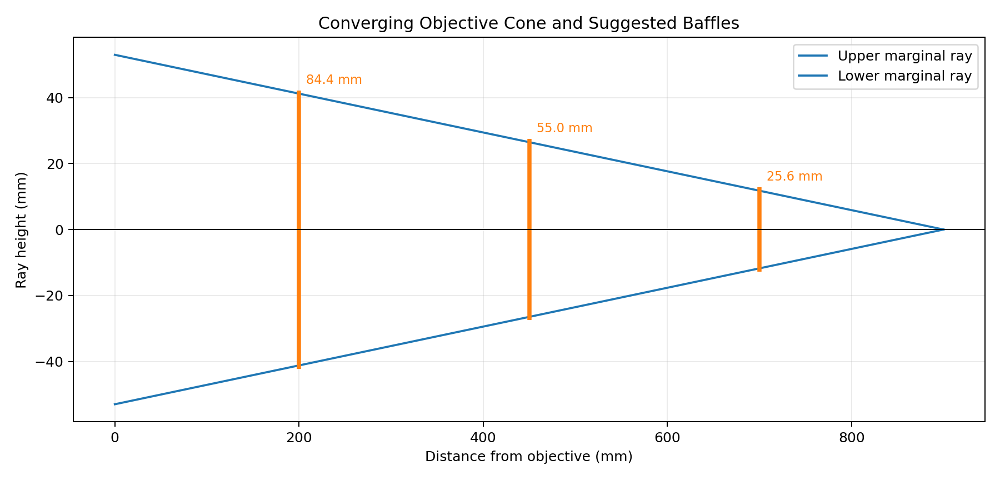
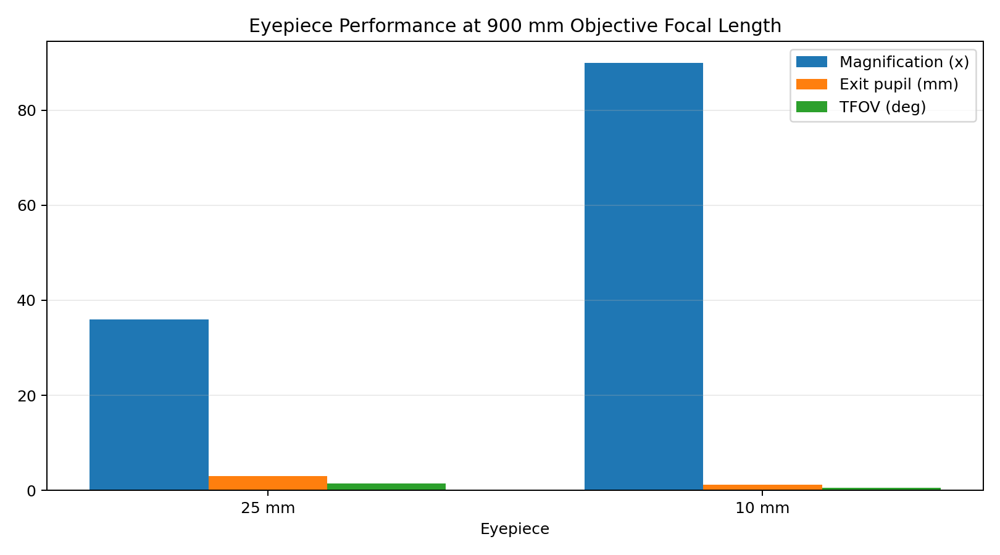
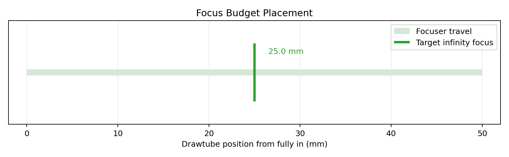
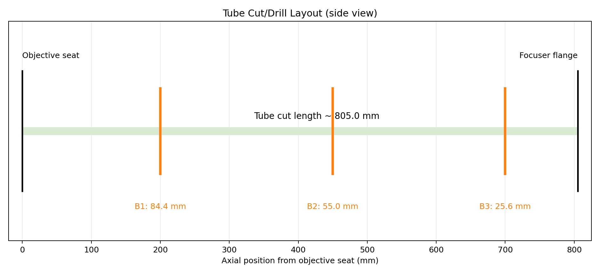
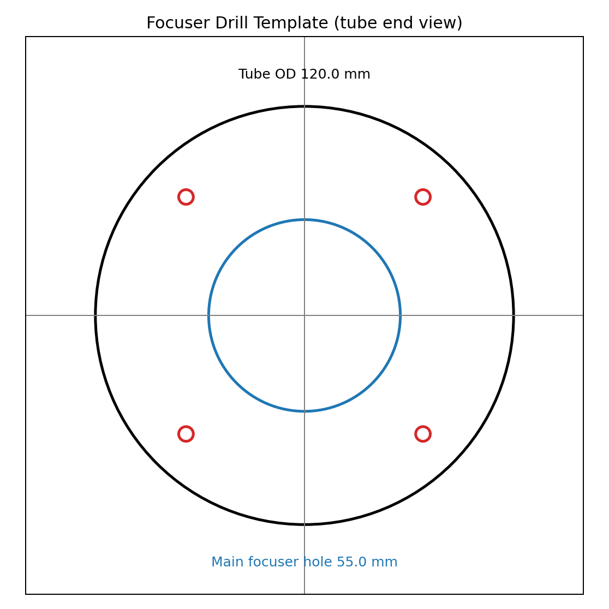
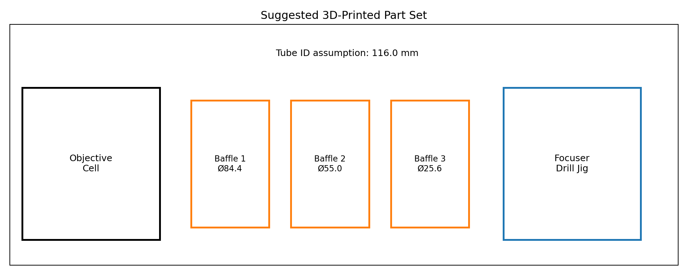

# Q001 Telescope Builder

Foundation project for modeling and assembling a DIY refractor telescope using:

- Objective lens: 106 mm diameter, 900 mm focal length (assumed)
- Eyepieces: 1.25" Plossl 25 mm and 10 mm (about 50 deg AFOV)
- Focuser travel: 50 mm

References:

- [Altair 1.25 inch Eyepiece Set (10 mm + 25 mm)](https://altairastro.com/125-inch-eyepiece-set-pl-10mm--25mm-11799-p.asp)
- [106 mm DIY objective listing](https://www.ebay.fr/itm/174771591801?utm_source=chatgpt.com)

## 1) Project Goal

Create a practical, testable foundation for:

1. Optical path calculations (magnification, exit pupil, field of view, diffraction estimate)
2. First-cut mechanical geometry (tube length and focus budget)
3. Initial baffle sizing
4. A step-by-step physical assembly process

This is intentionally a first engineering pass, not a full Zemax-grade design.

## 2) Quick Start

From this directory:

```bash
python model.py
```

The script prints:

- Telescope performance summary
- First-cut tube-length estimate
- Eyepiece performance table
- Suggested baffle diameters at example positions

It also generates plot images in `plots/`:

- `plots/beam_cone_and_baffles.png`
- `plots/eyepiece_performance.png`
- `plots/focus_budget.png`
- `plots/template_tube_layout.png`
- `plots/template_focuser_drill.png`
- `plots/template_printed_parts_overview.png`

It writes template dimensions to:

- `templates/template_dimensions.md`

## 3) Optical Model Used

Paraxial Kepler refractor model:

1. Distant objects send near-parallel rays into the objective.
2. Objective forms a real image near its focal plane (~900 mm behind objective).
3. Eyepiece is positioned so its focal plane coincides with that real image.
4. Eye sees a magnified virtual image at infinity.

Core equations:

- `M = f_obj / f_eye`
- `F# = f_obj / D_obj`
- `D_exit = D_obj / M = f_eye / F#`
- `TFOV ~= AFOV / M`
- Diffraction estimate (Rayleigh): `theta = 1.22 * lambda / D`

## 4) Current Assumptions

- Objective is treated as `f_obj = 900 mm`, `D = 106 mm`.
- Focuser travel is `50 mm`.
- Focuser flange-to-field-stop (fully in) is initially estimated in code as `70 mm`.
- Design target is to place infinity focus near mid travel (~25 mm out from fully in).

When you measure your actual focuser geometry, update:

- `focuser_flange_to_field_stop_infocus_mm`
- (optionally) `focus_margin_mm`

in `TelescopeConfig` inside `model.py`.

## 5) Generated Physics Illustrations

These are generated directly by the model and can be refreshed anytime by rerunning:

```bash
python model.py
```

### Optical cone and baffles



Shows the paraxial cone from the objective to focal plane and the suggested minimum baffle clear diameters at three axial positions.

### Eyepiece performance comparison



Compares magnification, exit pupil, and approximate true field for your 25 mm and 10 mm eyepieces on a 900 mm objective.

### Focus budget placement



Illustrates the 50 mm focuser travel and why targeting infinity focus near mid-travel is practical for build tolerance and eyepiece variation.

## 6) Cut/Drill Templates + 3D Printed Jigs

This project now includes first-pass printable templates in `templates/`:

- `templates/focuser_drill_jig.scad` - tube clamp jig with focuser and bolt-hole guides
- `templates/baffle_ring.scad` - parametric baffle ring
- `templates/objective_cell.scad` - objective lens cell + retaining ring preview
- `templates/template_dimensions.md` - generated dimension summary

### Tube cut and baffle placement template



Use this as the axial reference map:

- left edge = objective seat (`x = 0`)
- right edge = focuser flange (`x ~ 805 mm` with current assumptions)
- baffle positions marked at `x = 200, 450, 700 mm`

### Focuser drilling template



This graphic maps directly to `focuser_drill_jig.scad`:

- center circle = main focuser hole
- 4 corner circles = mounting bolt holes
- outer circle = assumed tube outside diameter

### Printed part set overview



Suggested first print set:

1. Objective cell and retaining ring
2. Baffle rings (3 sizes)
3. Focuser drilling jig

### Suggested printing process

1. Edit dimensions in the `.scad` files to match measured hardware.
2. Export STL from OpenSCAD.
3. Print test coupons (small ring sections) to validate fit.
4. Print full parts in PETG or ASA.
5. Dry-fit before drilling tube.

## 7) First-Cut Build Procedure (Physical Assembly)

1. **Objective mounting**
   - Build a centered lens cell.
   - Avoid pinching the lens; light retaining pressure only.

2. **Main tube**
   - Use the script's tube-length estimate as the first cut.
   - Keep extra margin by cutting slightly long if possible, then trim.

3. **Focuser installation**
   - Mount focuser square to the tube and centered to objective axis.
   - Ensure travel is smooth across full 50 mm range.

4. **Stray light control**
   - Matte-black interior.
   - Add 2-3 baffles using script outputs as minimum clear diameters.

5. **First light in daytime**
   - Start with 25 mm eyepiece.
   - Focus on a far terrestrial object.
   - Confirm infinity focus occurs within travel range.

6. **Night validation**
   - Check stars for symmetric focus behavior.
   - If strong asymmetry appears, re-check centering and tilt.

## 8) Notes on the "Microscope Mirror"

Do not use a random microscope mirror as a primary telescope mirror.
It may be useful only as a temporary fold element for experimentation, but quality/surface/coating are often unsuitable for sharp astronomical imaging.

## 9) Aberration Troubleshooting

For first-build aberration diagnosis and mitigation, see:

- [`aberration-analysis.md`](aberration-analysis.md)
- [`diagnostic-script.md`](diagnostic-script.md)

This includes:

- likely aberration modes for the reported image pattern
- interpretation of the 40 mm stop vs full-aperture comparison
- a mitigation sequence (stop-down, focus, alignment, camera coupling checks)
- a quick diagnostic matrix to separate chromatic/spherical/alignment/capture effects
- a timed 10-minute diagnostic script with pass/fail interpretation

## 10) What to Improve Next

After this foundation is validated, next steps are:

1. Measure actual tube OD/ID and focuser bolt pattern, then update `TemplateConfig` in `model.py`.
2. Regenerate plots + `template_dimensions.md` with `python model.py`.
3. Print and test-fit the templates before drilling.
4. Add optional diagonal/finder and mount-specific constraints.
