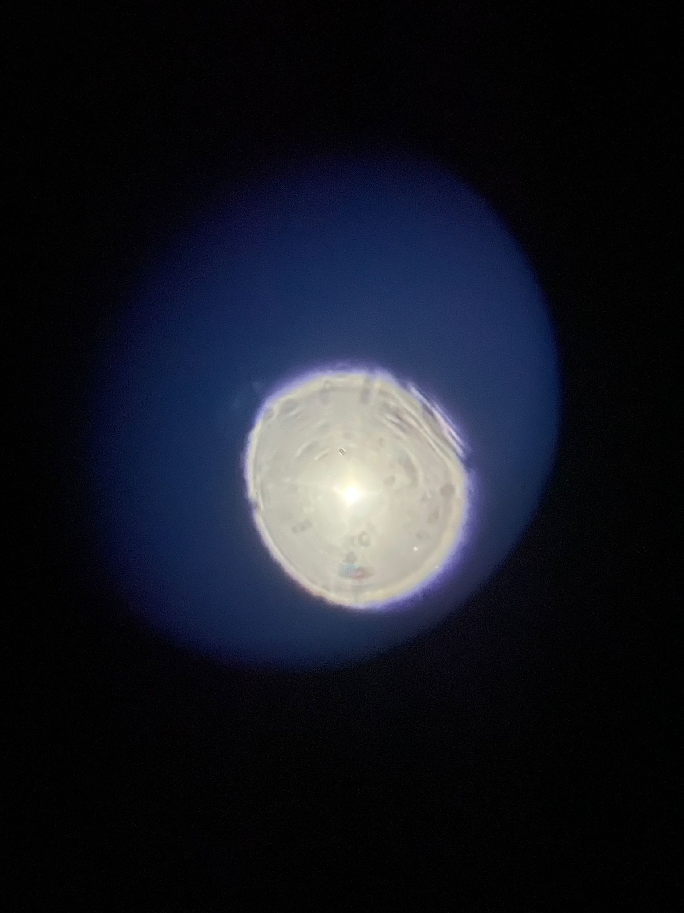
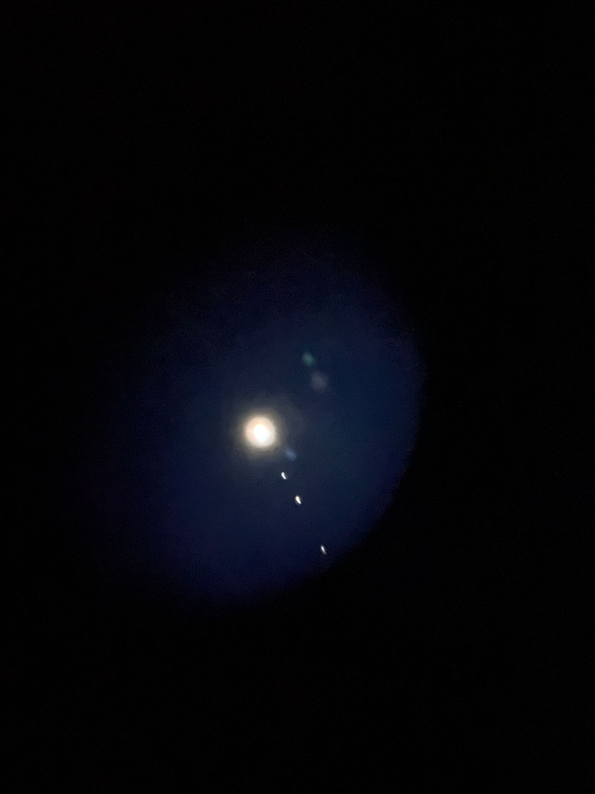
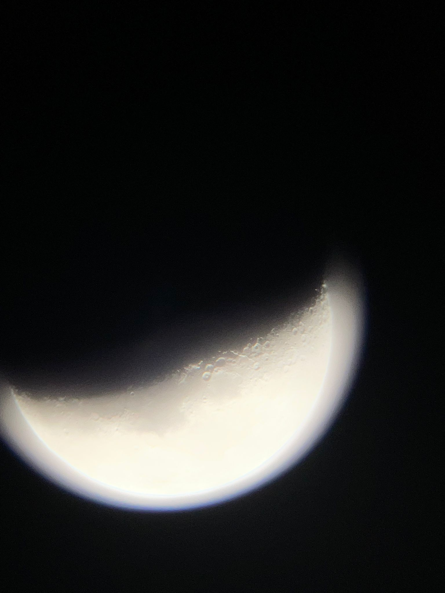

# Aberration Analysis (First Build)

This document captures the likely aberration modes observed in the first-build image and provides practical mitigation and test steps.

If terms like **halo**, **ghost**, **veiling**, or **terminator** (the Moon’s sunlit/night boundary—see glossary) are unfamiliar, start with [`optical-artifacts-glossary.md`](optical-artifacts-glossary.md).

For structured follow-up experiments, use:

- [`diagnostic-aperture-sweep.md`](diagnostic-aperture-sweep.md)
- [`diagnostic-baffle-sweep.md`](diagnostic-baffle-sweep.md)

**Confirmed build specs (builder-verified):**

- Objective focal length **`f_obj = 900 mm`**
- Focuser rack travel **±50 mm** (treat as **~100 mm total** usable travel in the model)

The analysis below uses those values for f-number and stop-down tradeoffs.

## 1) Observed Symptoms

From the reported image set:

- Strong blue/purple halo around bright targets at full aperture
- Soft edge definition and diffuse glow around high-contrast boundaries
- Slight asymmetry/irregularity in bright cores
- Ghost-like secondary bright spots in some full-aperture planet frames
- Similar appearance by eye and by camera (builder-confirmed), which reduces the chance that phone coupling is the main root cause

## 1.1) New Field Evidence (Aperture Mask Comparison)

Additional report from first-light testing:

- Full aperture (`106 mm`) shows strong halo/stray glow around bright objects.
- With a front mask using a `40 mm` hole, the halo nearly disappears.
- With the `40 mm` mask, perceived detail drops strongly.
- Eyepiece swap (including a microscope eyepiece) did not materially change the effect.
- Visual and camera impressions are reported to be very similar.

Related update: one through-the-tube moon photo discussed later was captured with a `60 mm` stop, so it should be treated as a mixed aperture+stray-light case rather than a full-aperture tube-only indicator. See [`retrofit-stray-light-plan.md`](retrofit-stray-light-plan.md) for the updated interpretation and the 4-frame (`106 mm` vs `60 mm`, with/without temporary flocking) A/B protocol.

Interpretation:

- This behavior strongly indicates an **objective-dominated, edge-ray problem** (spherical/chromatic residuals and possible lens-edge scatter), not just eyepiece quality.
- Baffles alone are unlikely to remove this, because they suppress tube stray light but do not correct intrinsic objective wavefront error.

## 1.2) Four-image reference set (embedded)

### Planet with 4 cm lid aperture

### Planet without lid (full aperture)

### Moon with 4 cm lid aperture

### Moon without lid (full aperture)

## 1.3) Image-by-image interpretation

- **Planet / no lid:** strongest halo and ghosting, consistent with marginal-ray driven chromatic/spherical residuals plus internal reflections.
- **Planet / 4 cm lid:** halo collapses strongly, matching a stop-down reduction in edge-ray aberrations.
- **Moon / no lid:** visible color fringes and veiling at bright limb; contrast washed near the terminator.
- **Moon / 4 cm lid:** cleaner edge rendering and reduced color haze, but lower fine-detail throughput and brightness.

How this ties to the **40 mm mask** result: both lunar and planetary frames confirm that high-contrast scenes at full aperture are dominated by marginal-ray behavior. Stopping down trims those rays first, cleaning the image at the cost of light grasp and diffraction-limited resolution.

## 1.4) Evidence table (quick review)

Use this table when discussing results with the builder or when deciding what to try next. **Confidence** is qualitative (High / Medium / Low) based on the image set and field reports, not a lab measurement.

| Image file | Observed artifacts | Likely optical mode(s) | Confidence |
|------------|-------------------|------------------------|------------|
| [`planet-no-lid.jpeg`](data/planet-no-lid.jpeg) | Large blue/violet halo; diffuse glow; secondary bright spots (ghost chain) | Longitudinal + lateral **chromatic**; **spherical** / zone residuals at full aperture; **internal reflections** (ghosts) | **High** |
| [`planet-lid-with-4cm-hole.jpeg`](data/planet-lid-with-4cm-hole.jpeg) | Halo strongly reduced; planet still bright; moons visible; some elongation or residual softness | Same modes **suppressed** by stop-down; residual may be tracking, slight defocus, or remaining CA/SA | **High** |
| [`moon-no-lid.jpeg`](data/moon-no-lid.jpeg) | Color fringes on limb; veiling / low contrast on terminator; possible faint ghost in dark sky | **Chromatic** + **spherical** / defocus across color; optional **ghost** path | **Medium to high** |
| [`moon_lid-with-4cm-hole.png`](data/moon_lid-with-4cm-hole.png) | Cleaner limb edges; less color haze; dimmer / softer fine detail vs no-lid | Stop-down trims marginal rays; **diffraction** and lower étendue limit detail | **High** |
| *(cross-cut)* Eye vs camera match | Same defects visible visually and on camera | Primary cause is **telescope + train**, not smartphone-only artifacts | **High** (per builder report) |

**How to read the table:** if a row’s “likely modes” improve when you only change aperture (same target, same eyepiece), treat that as evidence those modes are **aperture-driven** (marginal rays). If a symptom persists even at small stops, prioritize **alignment, ghosts, or focus**.

## 2) Most Likely Aberration Modes (ranked)

1. **Chromatic aberration (longitudinal + lateral)**  
   Most likely dominant mode given the colored halo. A **doublet** can still show strong residual color in white light if it is a modest achromat or not fully corrected for this speed and field.

2. **Defocus + spherical aberration residual**  
   The broad glow is consistent with focus not converging tightly across zones/colors.

3. **Tilt/decenter or lens stress (pinch)**  
   Asymmetry can come from objective/focuser axis mismatch or retaining ring preload.

4. **Afocal smartphone coupling artifacts (secondary)**  
   Still possible for framing/vignetting, but less likely to be the primary defect because the builder reports similar visual and camera appearance.

## 2.1) Why the 40 mm Mask Works

For this telescope:

- Full aperture mode: `D = 106 mm`, `f = 900 mm` -> about `f/8.5`
- Masked mode: `D = 40 mm`, `f = 900 mm` -> about `f/22.5`

Effects of stopping down to 40 mm:

- Removes outer lens zones where aberration often rises.
- Greatly reduces chromatic/spherical blur from marginal rays.
- Also reduces collected light to about `(40/106)^2 ~= 0.14` (about 14% of full aperture), and lowers ultimate diffraction-limited resolution.

This exactly matches the reported "halo gone, but much less detail" tradeoff.

## 3) Practical Mitigation Plan

Apply in this order:

1. **Stop down aperture** to about `70-80 mm` using a temporary mask.  
   If image sharpness improves strongly, geometric aberration burden is confirmed.

2. **Use 25 mm eyepiece first**, achieve best focus visually by eye, then test 10 mm.

3. **Check camera coupling** by comparing:
   - visual view through eyepiece (eye only)
   - smartphone afocal capture  
   Large mismatch means camera alignment is a major contributor.

4. **Relieve lens stress and verify centering**
   - Loosen retaining ring to light restraint only
   - Confirm objective is not pinched
   - Confirm focuser axis points to objective center

5. **Test with narrower spectral content** (e.g., green-ish source/filter).  
   Strong improvement indicates chromatic aberration is primary.

## 4) Quick Diagnostic Matrix

- **If stopping down helps a lot** -> spherical/chromatic geometric blur is significant.
- **If stopping down does not help** -> suspect gross focus/alignment/coupling problems.
- **If visual and phone are similarly degraded** -> telescope optics/mechanics dominate (current evidence points here).
- **If asymmetry changes when rotating eyepiece** -> eyepiece contribution is likely.
- **If asymmetry does not rotate with eyepiece** -> objective/alignment contribution is likely.

## 5) Build Implications

- For this objective class, prioritize:
  - slower effective beam (stop-down)
  - careful mechanical alignment
  - gentle lens mounting
  - realistic expectations in white-light, high-contrast scenes

- If performance target is higher (especially planets/lunar detail), consider:
  - achromatic/apochromatic objective upgrade
  - tighter collimation fixtures
  - controlled camera adapter geometry for repeatable afocal imaging

## 6) Updated Mitigation Priority (Based on Current Evidence)

1. Use an **intermediate stop** (`60-80 mm`, start near 70 mm) instead of 40 mm.
2. Improve objective mounting/alignment before more baffle iterations.
3. Add simple planetary contrast filtering (yellow/green) for bright targets.
4. Keep baffles as supporting glare control, not primary correction.
5. If full-aperture planetary performance remains unacceptable, upgrade objective type.

## 7) Next evidence pass

Before revising conclusions again, collect two new datasets:

1. Aperture sweep dataset from `diagnostic-aperture-sweep.md` (includes chosen `A_ref`).
2. Baffle sweep dataset from `diagnostic-baffle-sweep.md` at the same target class and `A_ref`.

Then re-score confidence in the evidence table based on measured baffle-state deltas.

