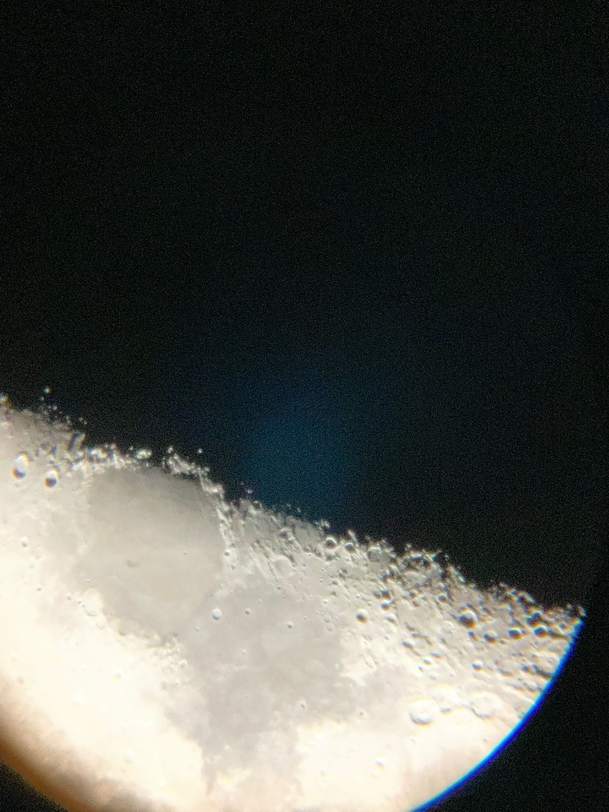

# Aberration Analysis (First Build)

This document captures the likely aberration modes observed in the first-build image and provides practical mitigation and test steps.

**Confirmed build specs (builder-verified):**

- Objective focal length **`f_obj = 900 mm`**
- Focuser rack travel **±50 mm** (treat as **~100 mm total** usable travel in the model)

The analysis below uses those values for f-number and stop-down tradeoffs.

## 1) Observed Symptoms

From the reported image:

- Strong blue/purple halo around a bright central target
- Soft edge definition and diffuse glow
- Slight asymmetry/irregularity in bright core shape
- Large dim colored field that may include camera-eyepiece coupling effects

## 1.1) New Field Evidence (Aperture Mask Comparison)

Additional report from first-light testing:

- Full aperture (`106 mm`) shows strong halo/stray glow around bright objects.
- With a front mask using a `40 mm` hole, the halo nearly disappears.
- With the `40 mm` mask, perceived detail drops strongly.
- Eyepiece swap (including a microscope eyepiece) did not materially change the effect.

Interpretation:

- This behavior strongly indicates an **objective-dominated, edge-ray problem** (spherical/chromatic residuals and possible lens-edge scatter), not just eyepiece quality.
- Baffles alone are unlikely to remove this, because they suppress tube stray light but do not correct intrinsic objective wavefront error.

## 1.2) Lunar terminator reference (digiscoped)

Reference capture of the Moon (terminator and bright limb) through the same build:

What this frame shows (typical for this class of problem):

- **Chromatic aberration:** blue/purple fringe on one limb, warmer (yellow/orange) tint on another — consistent with **longitudinal and lateral color** in white light on a high-contrast edge, not random “sensor noise.”
- **Veiling / low contrast:** haze extending from bright limb into sky and over fine crater detail — consistent with **residual spherical aberration**, slight defocus between colors, and scattered light in the tube.
- **Ghost in dark sky:** a faint diffuse spot away from the limb — consistent with **internal reflections** between air-glass surfaces or bright scatter finding a secondary image path; baffles and blackening help here, but they do not remove primary objective color error.
- **Circular vignette and edge softness:** typical of **afocal smartphone** placement; compare to a visual-only look at the same eyepiece setting.

How this ties to the **40 mm mask** result: the lunar limb is another high-contrast scene where **marginal rays** at full aperture drive both color and veiling; stopping down trims those rays first, which is why a small mask cleans the image at the cost of resolution and light grasp.

## 2) Most Likely Aberration Modes (ranked)

1. **Chromatic aberration (longitudinal + lateral)**  
   Most likely dominant mode given the colored halo. A **doublet** can still show strong residual color in white light if it is a modest achromat or not fully corrected for this speed and field.

2. **Defocus + spherical aberration residual**  
   The broad glow is consistent with focus not converging tightly across zones/colors.

3. **Tilt/decenter or lens stress (pinch)**  
   Asymmetry can come from objective/focuser axis mismatch or retaining ring preload.

4. **Afocal smartphone coupling artifacts**  
   Vignetting and off-axis phone alignment can exaggerate blur/halo appearance in photos.

## 2.1) Why the 40 mm Mask Works

For this telescope:

- Full aperture mode: `D = 106 mm`, `f = 900 mm` -> about `f/8.5`
- Masked mode: `D = 40 mm`, `f = 900 mm` -> about `f/22.5`

Effects of stopping down to 40 mm:

- Removes outer lens zones where aberration often rises.
- Greatly reduces chromatic/spherical blur from marginal rays.
- Also reduces collected light to about `(40/106)^2 ~= 0.14` (about 14% of full aperture), and lowers ultimate diffraction-limited resolution.

This exactly matches the reported "halo gone, but much less detail" tradeoff.

## 3) Practical Mitigation Plan

Apply in this order:

1. **Stop down aperture** to about `70-80 mm` using a temporary mask.  
   If image sharpness improves strongly, geometric aberration burden is confirmed.

2. **Use 25 mm eyepiece first**, achieve best focus visually by eye, then test 10 mm.

3. **Check camera coupling** by comparing:
   - visual view through eyepiece (eye only)
   - smartphone afocal capture  
   Large mismatch means camera alignment is a major contributor.

4. **Relieve lens stress and verify centering**
   - Loosen retaining ring to light restraint only
   - Confirm objective is not pinched
   - Confirm focuser axis points to objective center

5. **Test with narrower spectral content** (e.g., green-ish source/filter).  
   Strong improvement indicates chromatic aberration is primary.

## 4) Quick Diagnostic Matrix

- **If stopping down helps a lot** -> spherical/chromatic geometric blur is significant.
- **If stopping down does not help** -> suspect gross focus/alignment/coupling problems.
- **If visual is clean but phone is poor** -> smartphone coupling dominates artifacts.
- **If asymmetry changes when rotating eyepiece** -> eyepiece contribution is likely.
- **If asymmetry does not rotate with eyepiece** -> objective/alignment contribution is likely.

## 5) Build Implications

- For this objective class, prioritize:
  - slower effective beam (stop-down)
  - careful mechanical alignment
  - gentle lens mounting
  - realistic expectations in white-light, high-contrast scenes

- If performance target is higher (especially planets/lunar detail), consider:
  - achromatic/apochromatic objective upgrade
  - tighter collimation fixtures
  - controlled camera adapter geometry for repeatable afocal imaging

## 6) Updated Mitigation Priority (Based on Current Evidence)

1. Use an **intermediate stop** (`60-80 mm`, start near 70 mm) instead of 40 mm.
2. Improve objective mounting/alignment before more baffle iterations.
3. Add simple planetary contrast filtering (yellow/green) for bright targets.
4. Keep baffles as supporting glare control, not primary correction.
5. If full-aperture planetary performance remains unacceptable, upgrade objective type.

