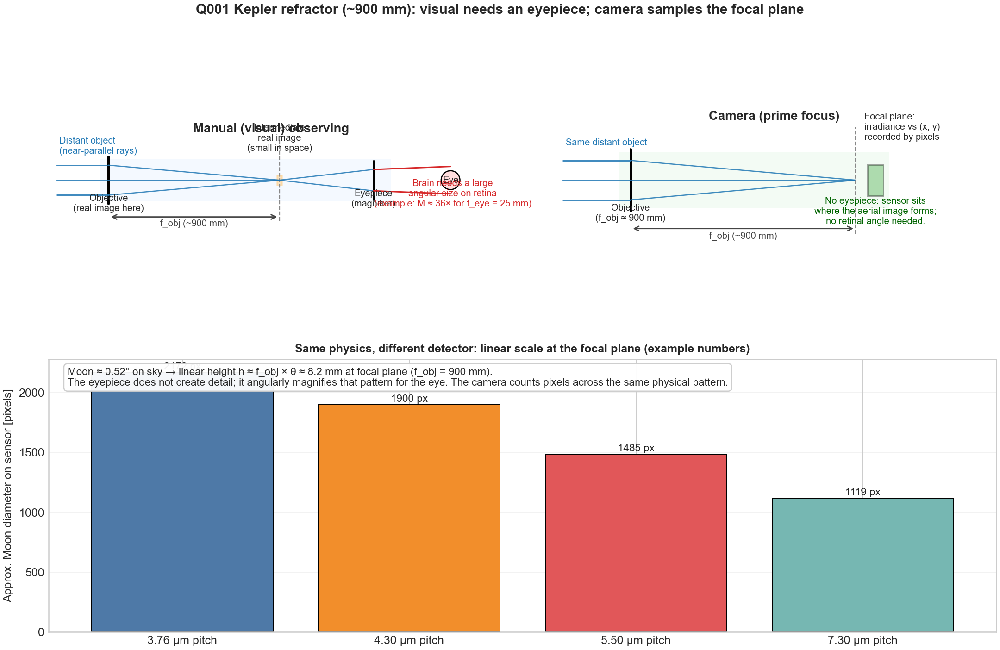
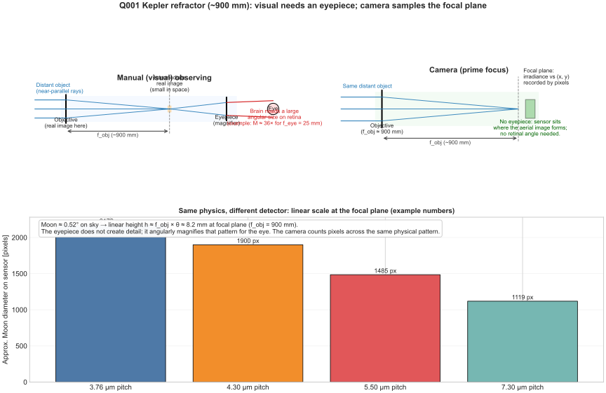

# From eyepiece to camera: imaging plan (Q001 refractor)

This document records a consolidated design discussion for the Q001 DIY Kepler refractor: **replacing or complementing visual observing with a camera**, prioritizing **Moon and planets** first, with a path toward **deep-sky imaging** later. It aligns with the optical model and tooling described in [`README.md`](README.md).

---

## Executive summary

- **Primary recommendation:** Move to **prime-focus imaging** first (camera replaces eyepiece), verify focus with the thinnest adapter stack, then add a **2x Barlow** for Jupiter/Saturn scale.
- **System baseline:** Q001 is a **900 mm, ~106 mm refractor** (~f/8.5) with **1.25" focuser** and about **100 mm** total travel; keep infinity focus near mid-travel when possible.
- **What to buy first (Switzerland):** 1.25" to **T2 (M42x0.75)** camera coupling, camera (or T-ring if DSLR/mirrorless), then a **2x Barlow**, then only the spacers needed after first-light focus checks.
- **How to validate quickly:** Focus on Moon or a bright star at prime focus, record focuser position, compare against [`plots/focus_budget.png`](plots/focus_budget.png), then repeat after adding the Barlow.
- **Data strategy:** Continue the existing aperture/baffle diagnostic workflow, now with camera logging for better reproducibility (fixed gain/exposure or fixed histogram target, plus focuser position and Barlow factor in CSV notes).
- **Deep-sky timing:** Defer large sensor upgrades until mount tracking, calibration frames, and stacking workflow are repeatable.

---

## 1. Purpose and how to use this doc

- **Use it for:** choosing a camera interface, ordering adapter parts, planning **prime focus** and **Barlow** setups, and running **reproducible** aperture vs artifact experiments with the existing CSV workflow.
- **It does not replace:** vendor-specific spacing sheets for flatteners/reducers (mostly a **deep-sky / wide-field** concern), full optical design software, or mount/autoguiding manuals.

---

## 2. Telescope baseline (this project)

From [`README.md`](README.md) and `model.py` assumptions unless you update measured values:

| Quantity | Nominal / confirmed |
|----------|---------------------|
| Architecture | **Keplerian refractor** (objective forms a real focal image; no central obstruction) |
| Objective focal length \(f_{\mathrm{obj}}\) | **900 mm** (confirmed) |
| Clear aperture \(D\) | **~106 mm** (nominal; measure at cell if critical) |
| Focal ratio | \(f_{\mathrm{obj}}/D \approx\) **f/8.5** |
| Focuser | **1.25″** barrel eyepieces in use today |
| Focuser travel | **~100 mm total** (builder: **±50 mm** from neutral) |
| Visual eyepieces (reference) | Plossl **25 mm** and **10 mm** (~50° AFOV) |

Visual magnification (infinity objects) follows the project model:

\[
M \approx \frac{f_{\mathrm{obj}}}{f_{\mathrm{eye}}}
\]

So **25 mm** → \(900/25 \approx 36\times\), **10 mm** → **90×**. Exit pupil:

\[
D_{\mathrm{exit}} \approx \frac{D}{M} \approx \frac{f_{\mathrm{eye}}}{f/\#}
\]

These formulas describe **visual** bundles. For **imaging**, the analogous planning quantity is **plate scale** on the sensor (Section 6).

**Focus budget sanity check:** Regenerate [`plots/focus_budget.png`](plots/focus_budget.png) with `python model.py` after you change measured focuser geometry in `TelescopeConfig` (`focuser_flange_to_field_stop_infocus_mm`, travel, margins). The plot is the first sanity check that **prime focus** (and later **Barlow**) land inside usable rack range—not at a mechanical extreme.

---

## 3. Intent: targets and phases

### Phase A — Moon and planets (now)

- **Moon:** very bright; short exposures; risk of **saturation** and **scattered light** (limb glare, terminator veil). Your **baffle** and **aperture-stop** experiments (see [`diagnostic-aperture-sweep.md`](diagnostic-aperture-sweep.md), [`diagnostic-baffle-sweep.md`](diagnostic-baffle-sweep.md)) apply directly; stopping down often reduces **chromatic** and marginal-ray error on the limb.
- **Planets (Jupiter, Saturn, etc.):** small angular size; you usually want **more effective focal length** than prime 900 mm gives on typical pixels—hence a **Barlow** or equivalent (Section 9).

### Phase B — Deep sky (later)

Same telescope, but success is dominated by:

1. **Mount tracking quality** (and often autoguiding as exposures lengthen).
2. **Calibration frames** (bias/dark/flat) and stacking workflow.
3. **Integration time** and sky darkness—not sensor area first.

**Recommendation:** Do **not** optimize for the largest sensor until tracking and calibration are under control. Optional later optics: **field flattener** or **focal reducer** with manufacturer-specified **sensor spacing**—a wide-field topic, not required for small-field planetary work on-axis.

---

## 4. How a camera “replaces” the eyepiece

### 4.1 Prime focus (default for serious imaging)

Remove the eyepiece. The **camera sensor** is placed so its photosensitive surface lies at the **telescope’s focal plane** (the same axial location where the intermediate image formed for visual observing, before the eyepiece magnified it).

- **Pros:** Full aperture imaging path; standard for astrophotography; best basis for **lucky imaging** on planets (high frame rate, stack best frames).
- **Cons:** Requires correct **mechanical adapters** and enough **focuser in-travel / out-travel** for your stack.

### 4.2 Afocal (camera looks through an eyepiece)

The camera lens images the **exit pupil** of the eyepiece. This is the “phone held to eyepiece” class of setup.

- **Pros:** Quick experiments.
- **Cons:** Hard to align repeatably; extra glass; generally inferior for a permanent “eyepiece replacement.”

**Project default:** Treat **prime focus** (with or without **Barlow**) as the main path.

---

## 5. Mechanical coupling (1.25″ focuser)

Eyepieces use **1.25″** (or sometimes **2″**) barrels. Cameras use threaded interfaces, commonly:

- **T-thread:** M42 × 0.75 mm (often called “T2” in astro listings), or **M48** on some flatteners/camera-side hardware.

Typical **prime-focus** stack:

1. **1.25″ nosepiece** (slips into focuser like an eyepiece) with **female T-thread** on the camera side, **or** a combined “T-adapter” that mates to your camera.
2. **Spacer / extension tubes** only if needed to reach focus (Section 7).
3. Camera body, or **T-ring** matching a DSLR/mirrorless body used **without lens** (lens cap replaced by ring + telescope adapter).

**Raspberry Pi Camera Module:** No universal eyepiece standard; you need a **third-party or printed** holder that centers the sensor on the axis and sets **sensor-to-flange** distance. **USB planetary cameras** and **dedicated CMOS astro cams** are often easier on both Pi (INDI ecosystem) and laptops (ASCOM / vendor apps / N.I.N.A., SharpCap, etc.).

**Vendor note:** Do not treat specific part numbers as permanent; buy from current astronomy retailer listings and confirm **male/female** thread and **1.25″** vs **2″** compatibility.

---

## 6. Plate scale and “effective magnification”

There is no eyepiece magnification in prime focus. Instead, relate **focal length** to **pixels on sky**:

### Visual vs camera coupling figure (generated)





This schematic shows the same telescope objective used in two coupling modes: for **manual visual use**, the eyepiece converts the intermediate image into a comfortable angular view for the eye; for **prime-focus camera use**, the sensor is placed at the focal plane and samples the image directly.

Regenerate:

```bash
python scripts/plot_visual_vs_camera_coupling.py
```

\[
\text{arcsec per pixel} \approx 206265 \times \frac{p_{\mathrm{mm}}}{f_{\mathrm{mm}}}
\]

where \(p_{\mathrm{mm}}\) is pixel pitch (mm) and \(f_{\mathrm{mm}}\) is the **effective** focal length of the telescope **including Barlow** (e.g. \(f_{\mathrm{mm}} \approx 1800\) for **900 mm × 2× Barlow** if nominal).

**Example (prime focus, 900 mm):** If \(p = 2.9\,\mu\mathrm{m} = 0.0029\,\mathrm{mm}\),

\[
206265 \times \frac{0.0029}{900} \approx 0.66\ \text{arcsec/pixel.}
\]

Jupiter’s apparent diameter is often of order **40″** → disk spans order **60 pixels**—usable for stacking, but many builders add **2×–3×** Barlow for **disk detail**.

**Diffraction (order of magnitude):** Rayleigh criterion \(\theta \sim 1.22\,\lambda/D\) with \(\lambda \sim 550\,\mathrm{nm}\) gives a physical resolution scale set by **aperture**; **seeing** (often ~1–2″ for many sites) often limits planets before diffraction does. “Empty” magnification (visual concept) maps loosely to **oversampling** past what seeing and optics support—balance with Barlow choice and exposure length.

---

## 7. Back focus and focuser travel (this build)

- The sensor must sit at **infinity focus** for your objective position.
- Your README documents **~100 mm total** focuser travel and a design goal of placing infinity focus **near mid-travel** to absorb tolerances.
- **Barlows** typically shift the focal surface **axially**; in practice you often need **more focuser inward** travel than for prime focus alone. If you **run out of inward** travel:
  - Shorten the adapter stack (lower-profile nosepiece / fewer extensions).
  - Try a **different Barlow** design (short vs long) per manufacturer behavior.
  - Do **not** exceed mechanical focuser limits.

**Procedure:** Record focuser position (mm or “ticks”) for **prime focus**, then for **Barlow + camera**, and compare to [`plots/focus_budget.png`](plots/focus_budget.png).

---

## 8. Camera options vs host (Pi vs laptop)

| Approach | Pi-friendly | Laptop-friendly | Notes |
|----------|-------------|------------------|-------|
| **USB CMOS astro camera** | Often (INDI / drivers permitting) | Yes | Strong default for telescope prime focus; many support **high frame rate** for planets. |
| **DSLR / mirrorless (T-ring + adapter)** | Possible; heavier | Very common | Large sensor; good for Moon wide field; tracking matters more for DSO. |
| **Raspberry Pi Camera Module** | Native | Stream from Pi | Small sensor → narrow sky patch at 900 mm; adapters must control **sensor spacing**; great for embedded projects. |

**Software (high level):** Laptops: capture + stacking (e.g. AutoStakkert!, RegiStax, Siril). Raspberry Pi: INDI-compatible devices or capture on-device then transfer files to a PC for heavy stacking.

---

## 9. Barlow for Jupiter and Saturn (decision recorded)

**Goal:** Increase **effective focal length** so the planet spans more pixels (Section 6), without making acquisition impossible on your mount.

**Recommendation:**

- Start with a **2× Barlow** on **900 mm** → **~1800 mm** effective focal length. Good step for **Jupiter / Saturn** scale on typical sensors.
- Reserve **3×** or stronger for when **seeing**, **tracking**, and **2×** results justify it.

**Placement:** **Barlow in the focuser drawtube**, then **camera** (via nosepiece / T-thread) on the Barlow’s output side. Keep the train **rigid**; flex appears as **drift** between frames.

**Barlow quality note:** Nominal magnification can depend on **spacing** between Barlow element and sensor on simple designs; premium **telecentric**-style amplifiers (e.g. Powermate-class) often behave more predictably. Read the manufacturer’s note on **working distance** for nominal **2×**.

**Focus travel:** Re-check **full inward** range after adding the Barlow (Section 7).

---

## 10. Prime focus checklist (before Barlow)

1. Assemble the **thinnest** reliable adapter stack (Section 5).
2. Point at **Moon** or **bright star**; achieve **sharp focus**.
3. Note focuser position vs [`plots/focus_budget.png`](plots/focus_budget.png) mid-travel goal.
4. Only then add **Barlow** and repeat focus + position check.

**Safety:** Never point at the **Sun** without a **full-aperture** solar filter designed for visual/photographic use on your optical system. Moon and night sky do not use the same solar filtering shortcuts.

---

## 11. Aperture vs artifacts: CSV workflow with the camera

Your project already separates **lens-driven** effects (aperture sweep) from **tube stray light** (baffle sweep); see [`README.md`](README.md) Section 10–11 and [`diagnostic-aperture-sweep.md`](diagnostic-aperture-sweep.md).

**With a camera, reproducibility improves if you:**

- Fix **exposure / gain** (or fix **histogram peak**) for each compared configuration.
- Log **Barlow factor**, **stop diameter** (`D_stop`), **focuser position**, and environmental notes in **`comments_observations`** in [`templates/aperture-sweep-log.csv`](templates/aperture-sweep-log.csv) (and baffle CSV when relevant).
- **Refocus after each stop change** (README: best-focus shifts when the pupil changes).

Stopping down often reduces **chromatic** and marginal-ray blur on the **Moon’s limb**—the same physics as visual aperture sweeps, now with quantitative frames.

---

## 12. Collimation and verification (refractor)

This instrument is a **refractor**: no Newtonian secondary **collimation** routine. Verification is still important:

- **Star test** or **Ronchi** concepts (high level) for objective quality assessment—external guides suffice for first builds.
- **Mechanical:** focuser square to tube, objective centered; tilt shows as **asymmetric** star focus (see README first-light steps).

---

## 13. Shopping list (Switzerland)

This list is optimized for your current plan: **Moon and planets first**, **prime focus first**, then **2x Barlow**.

### 13.1 Swiss-first vendors to check

Use these as first-pass sources for local stock, support, and easier returns:

- [teleskopshop.ch](https://www.teleskopshop.ch/en/shop/)
- [deep-space-astronomy.ch](https://deep-space-astronomy.ch/en/)
- [proastro.ch / Kochphoto](https://shop.proastro.ch/)

Swiss general electronics/photo marketplaces can occasionally have useful adapters, but astro-specialist shops usually provide better compatibility guidance for thread standards and spacing.

### 13.2 Core shopping list (minimum to start)

1. **1.25" camera coupling hardware**
   - 1.25" nosepiece with **T2 (M42x0.75)** thread
   - If DSLR/mirrorless body: matching **T-ring** for your camera mount
2. **2x Barlow (1.25")**
   - Start with 2x for Jupiter/Saturn scale at your 900 mm objective
3. **Camera (planetary-friendly first)**
   - Priority: USB CMOS camera with good planetary software support
   - Alternative: existing DSLR/mirrorless if already owned
4. **Small adapter/spacer set**
   - A few short T2 spacers to tune focus position and mechanical seating
5. **Capture/control essentials**
   - USB cable quality/length appropriate for your setup
   - Optional powered USB hub if camera disconnects occur

### 13.3 Nice-to-have (phase 2, after first light works)

- **UV/IR-cut filter** (for one-shot color cameras if sensor is IR-sensitive)
- **Bahtinov mask** for faster repeatable focusing
- **Dew control** (simple heater strap / dew shield) for session stability
- **Telecentric amplifier** upgrade later (if 2x Barlow spacing sensitivity is annoying)

### 13.4 Raspberry Pi path (if you want Pi control early)

- Prefer cameras with known **Linux/INDI** support.
- If using a Pi Camera Module, add:
  - rigid 1.25" adapter holder
  - precise sensor centering and spacing control
- Plan to do heavy stacking on a laptop/desktop even if capture is on Pi.

### 13.5 Buy order (recommended)

1. Buy **camera coupling + camera** (no Barlow yet).
2. Confirm **prime focus** on Moon/bright star with the thinnest stack.
3. Buy/add **2x Barlow** and re-check focus travel.
4. Buy optional filters/accessories only after you verify repeatable capture.

### 13.6 Compatibility checklist before checkout

- **Barrel size:** 1.25" everywhere in the train
- **Thread standard:** T2 = M42x0.75 (not generic camera M42 variants)
- **Gender match:** male/female thread sides on all couplers
- **Back focus behavior:** any required spacing for nominal Barlow factor
- **Mechanical clearance:** camera body and cables do not hit focuser knobs/tube

---

## 14. Related files in this repository

| File | Relevance |
|------|-----------|
| [`README.md`](README.md) | Optical model, terms, focuser assumptions, plot regeneration |
| [`model.py`](model.py) | `TelescopeConfig`, focus budget inputs |
| [`plots/focus_budget.png`](plots/focus_budget.png) | Focuser travel sanity check for prime and Barlow stacks |
| [`diagnostic-aperture-sweep.md`](diagnostic-aperture-sweep.md) | Aperture sweep protocol |
| [`diagnostic-baffle-sweep.md`](diagnostic-baffle-sweep.md) | Baffle sweep protocol |
| [`templates/aperture-sweep-log.csv`](templates/aperture-sweep-log.csv) | Logging template (extend comments for camera settings) |
| [`aberration-analysis.md`](aberration-analysis.md) | Artifact interpretation |
| [`retrofit-stray-light-plan.md`](retrofit-stray-light-plan.md) | Stray-light retrofit context (complementary to imaging) |

---

## 15. Summary table (decisions)

| Topic | Decision |
|-------|----------|
| Primary coupling | **Prime focus** via **1.25″** nosepiece / T-thread stack |
| First target class | **Moon and planets** |
| Focal lengthening | **2× Barlow** first; then evaluate **3×** if needed |
| Focus verification | Use **`plots/focus_budget.png`** + recorded focuser positions |
| Experiments | Continue **aperture (and baffle)** CSV logging; camera improves repeatability |
| Deep sky | **Later:** tracking, calibration, stacking before large sensors; flatteners/reducers as needed |

---

## Appendix A. One-page field checklist (Moon/planets)

Use this as a practical session sheet for the current project phase.

### A1. Pre-session (daylight, 10-15 min)

- [ ] Objective and front cell clean enough (no new fingerprints/dew film).
- [ ] Focuser motion smooth across full travel; lock/tension adjusted.
- [ ] Camera cables strain-relieved; no snag through motion range.
- [ ] Imaging train assembled and square:
  - [ ] Prime-focus stack (thinnest reliable).
  - [ ] Optional 2x Barlow ready but not installed for first focus test.
- [ ] Mount/tripod stable; basic balance acceptable.

### A2. First optical confirmation (night start)

- [ ] Target: Moon limb or bright star.
- [ ] Prime focus first:
  - [ ] Reach sharp focus.
  - [ ] Record focuser position: `__________`.
  - [ ] Compare with [`plots/focus_budget.png`](plots/focus_budget.png) expectation.
- [ ] Add 2x Barlow and refocus:
  - [ ] Reach sharp focus with remaining travel margin.
  - [ ] Record focuser position with Barlow: `__________`.
  - [ ] If no focus, shorten stack or revise Barlow spacing/adapter profile.

### A3. Capture setup (planetary/lunar)

- [ ] File format set (RAW/ser/fits equivalent for your software path).
- [ ] Gain/exposure strategy chosen:
  - [ ] Fixed exposure+gain for controlled comparisons, or
  - [ ] Fixed histogram target `%`: `__________`.
- [ ] ROI/crop set for planets (higher frame rate) or full frame for Moon region.
- [ ] Focus aid used (live zoom / mask / edge contrast on limb).
- [ ] White balance or color mode noted (if relevant to camera).

### A4. Session logging (reproducibility)

Log one row per test condition in your CSV workflow and include:

- [ ] Target (Moon/Jupiter/Saturn), altitude/time window.
- [ ] Aperture stop (`D_stop`) used.
- [ ] Barlow factor (none/2x/other).
- [ ] Focuser position at best focus.
- [ ] Exposure/gain or histogram target.
- [ ] Seeing/transparency notes in `comments_observations`.

Suggested files:

- [`templates/aperture-sweep-log.csv`](templates/aperture-sweep-log.csv)
- [`templates/baffle-sweep-log.csv`](templates/baffle-sweep-log.csv)

### A5. On-the-spot troubleshooting

- **Soft image everywhere:** re-focus, confirm thermal equilibrium, verify no drawtube tilt.
- **Cannot reach focus with Barlow:** reduce adapter length, check Barlow spacing guidance.
- **Planet too small at prime focus:** use 2x Barlow, then re-evaluate seeing before going stronger.
- **Strong limb color/halo on Moon:** run stop-down comparison and log settings.
- **Contrast wash/veil near bright limb:** test baffling state and internal reflections.

### A6. End-of-session checklist

- [ ] Save raw data and note folder name: `__________`.
- [ ] Backup to second location.
- [ ] Mark best clips/frames for stacking.
- [ ] Note one improvement for next night (mechanical, focus workflow, or settings).

---

*Document version: written to consolidate project discussion; update measured focuser fields in `model.py` as hardware is finalized.*
